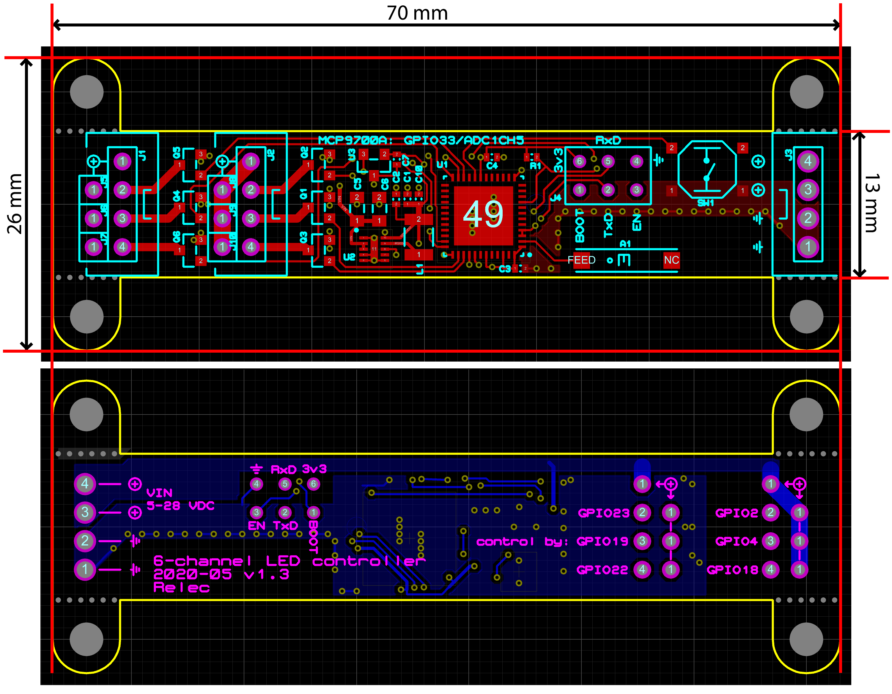

# 6-channel Light Controller


### Programming

You need a separate TTL-level serial port for programming. There is no integrated USB-to-serial converter or similar to save space.

The programming connector is a 6-pin connector on the PCB with all the pins labeled.
You need to connect ```RxD``` on the board to ```TxD``` and ```TxD``` on the board to ```RxD``` on your serial port.

## Connecting to a light

1. Solder whatever connectors you want to use
1. Connect a LED strip, lamp or similar that you want to control
1. Connect a power supply, 5-28 VDC
    * The power supply used must be one that fits the LED strip whatever that you connected to the outputs

## Hardware

The device is designed to fit in a 16x16mm cable duct that you easily find from hardware stores (though you need to cut away the extras on the PCB).



* ESP32-PICO-D4 MCU
    * GPIO2: LED PWM channel 0
    * GPIO4: LED PWM channel 1
    * GPIO18: LED PWM channel 2
    * GPIO23: LED PWM channel 3
    * GPIO19: LED PWM channel 4
    * GPIO22: LED PWM channel 5
    * GPIO13: Push button
    * GPIO33/ADC1CH5: MCP9700A temperature sensor
